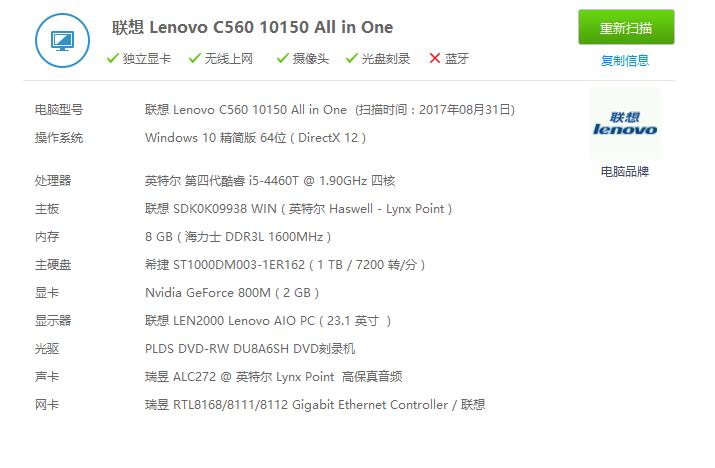
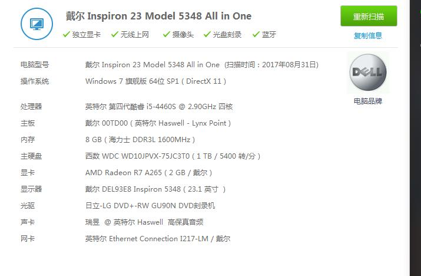
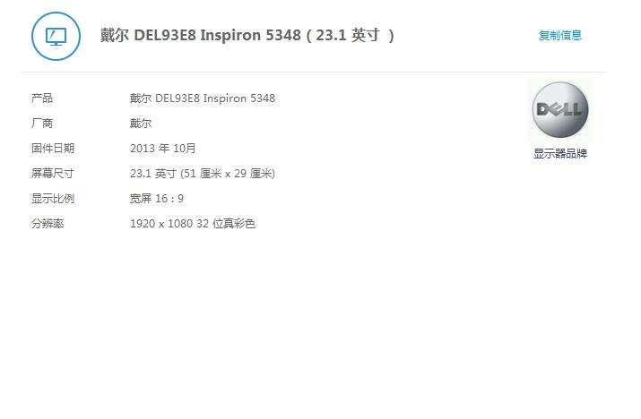
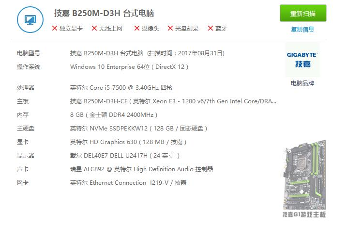
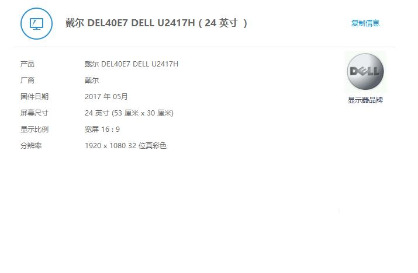

## 一体机

* LENOVOC560 两台

  

* DELL 一体机

* DEll技嘉 B250-D3H 台式电脑

   

  

  ## 显示器

* HYUNDAI (现代显示器)

  21英寸显示器分辨率 1920*1080

* ViewSonic VX2270Smh-LED

   分辨率不太清楚

* DELL  U2414Hb

  显示器分辨率 1920*1080

## 主机

* DELL Vostor

   